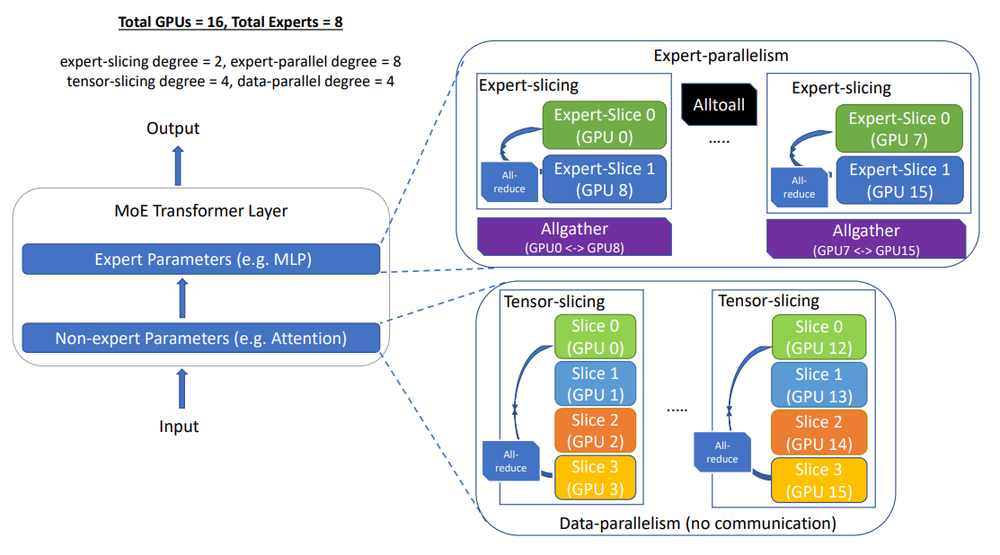
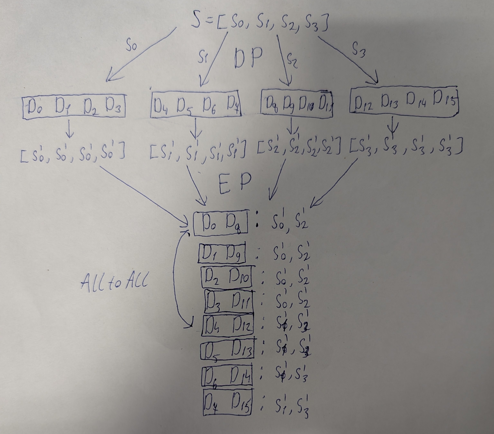
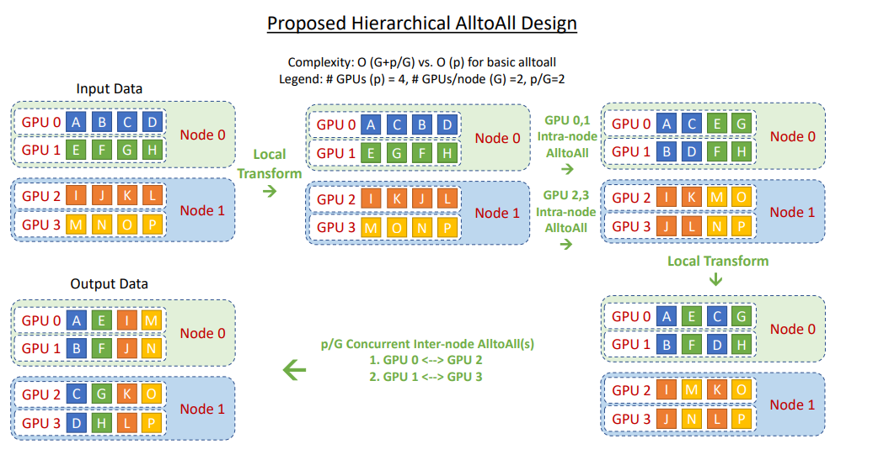
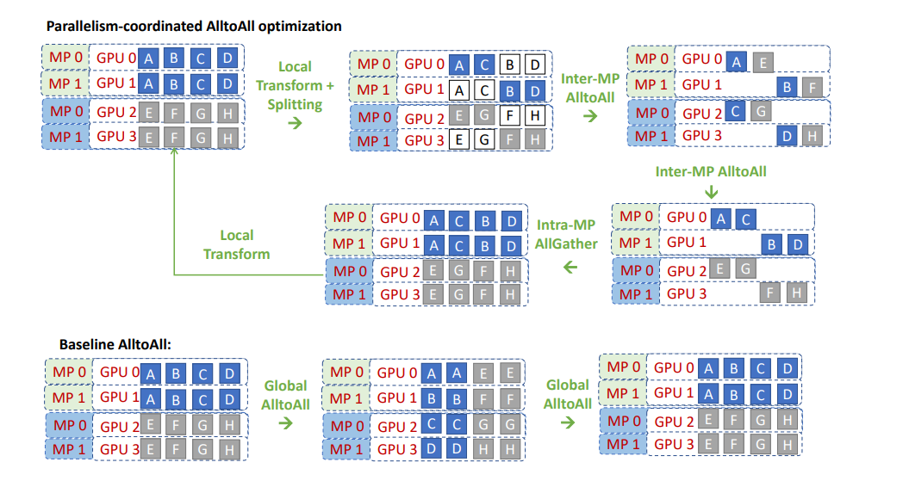
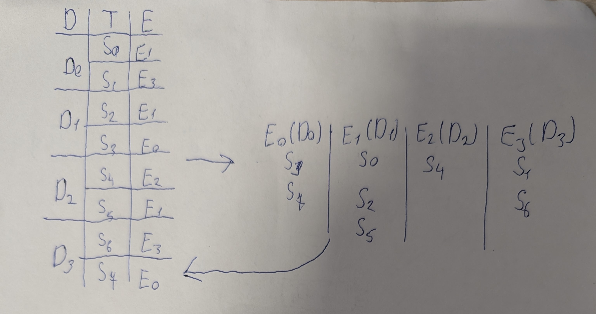

# DeepSpeed-MoE: Advancing Mixture-of-Experts Inference and Training to Power Next-Generation AI Scale [ссылка](https://arxiv.org/pdf/2201.05596)

**P.S. здесь чисто описание архитектуры для inference. В статье есть еще некоторый дополнительный материал**

DeepSpeed-MoE имеет 3 типа оптимизаций для MoE:
 1. Тщательное разделение модели и использование различных типов параллелизма; Существует возможность группировать и маршрутизировать все токены с одинаковым критическим путём данных вместе, чтобы сократить доступ к данным для каждого устройства и достичь максимальной совокупной пропускной способности;
 2. Оптимизированное расписание коммуникации с координацией параллелизма, чтобы эффективно группировать и направлять токены;
 3. Оптимизация ядер трансформера и MoE для улучшения производительности на каждом устройстве.

 ## 1. Flexible Combination of Tensor-Slicing, Expert-Slicing, Data Parallelism, and Expert Parallelism.

Чтобы достичь низкой задержки и высокой пропускной способности на беспрецедентном уровне для MoE, мы разрабатываем нашу систему инференса таким образом, чтобы минимизировать критический путь данных на каждое устройство, максимизировать достигаемую совокупную пропускную память и одновременно предлагать достаточную совокупную память для обеспечения масштабных размеров моделей, используя (1) экспертный параллелизм и нарезку по экспертным параметрам и (2) параллелизм данных и нарезку тензоров для неэкспертных параметров. Рисунок ниже иллюстрирует один слой Transformer MoE, который содержит как экспертов (например, MLP), так и неэкспертные параметры (например, внимание), и как мы используем комбинацию стратегий параллелизма для обработки каждого компонента. 

### Expert Parallelism and Expert-slicing for Expert Parameters

Как показано в парадоксе производительности MoE, хотя каждый токен активирует только одного эксперта на каждом слое MoE, для пакетного вывода с множеством токенов суммарные параметры, необходимые для всех токенов, могут быть столь же большими, как весь набор параметров, что затрудняет достижение как низкой задержки, так и высокой пропускной способности. Чтобы решить эту проблему, мы разделяем экспертов между устройствами, группируем все входные токены, назначенные тем же экспертом, под одним критическим путем данных и параллелим обработку групп токенов с различными критическими путями между разными устройствами, используя параллелизм экспертов. 

В примере с 1,3B+MoE-128, когда параллелизм экспертов равен 128, каждая GPU обрабатывает только одну группу токенов, соответствующую экспертам на этом устройстве. Это приводит к последовательному пути, который составляет 1,3 миллиарда параметров на устройство, что в 5 раз меньше, чем эквивалентная плотная модель качества с 6,7 миллиарда параметров (под эквивалентностью понимается качество модели). Таким образом, теоретически модель на основе MoE имеет потенциал работать в 5 раз быстрее, чем эквивалентная плотная модель качества, используя параллелизм экспертов при условии отсутствия накладных расходов на связь, тема, которую мы обсудим в следующем разделе. 

Кроме того, мы предлагаем «нарезку экспертов», чтобы использовать концепцию нарезки тензоров для параметров внутри эксперта, которая горизонтально/вертикально делит параметры эксперта через несколько графических процессоров. Этот дополнительный аспект параллелизма полезен для сценариев, требующих низкой задержки, когда мы масштабируем на большее количество устройств, чем количество экспертов.

**Пояснение:** Откуда берется AllGather на рисунке:

### Data Parallelism and Tensor-slicing for Non-expert Parameters

Хотя экспертный параллелизм уменьшает количество параметров эксперта на критическом пути на одно устройство, он не снижает количество неэкспертных параметров на критическом пути. Это приводит к двум ограничениям: (1) максимальный размер неэкспертных параметров в модели MoE, которые могут быть проинференсированы, ограничен памятью одного устройства, и (2) задержка выполнения неэкспертных компонентов модели ограничена пропускной способностью памяти одного устройства. 

Мы используем тензорный параллелизм в рамках узла для решения этих узких мест, что позволяет использовать сотни миллиардов неэкспертных параметров, используя агрегированную память GPU, а также используя агрегированную пропускную способность памяти GPU на всех GPU в рамках узла. Хотя возможно проводить тензорный параллелизм между узлами, накладные расходы на коммуникацию при тензорный параллелизм, а также сниженная гранулярность вычислений обычно делают тензорный параллелимз между узлами нецелесообразным. Для масштабирования неэкспертных параметров на нескольких узлах мы используем параллелизм данных, создавая реплики неэкспертных параметров, обрабатывающие различные пакеты между узлами, что не несет накладных расходов на связь и не уменьшает гранулярность вычислений.

## 2. Optimized Communication Subsystem: Grouping and Routing Tokens More Efficiently

NCCL не очень хорошо подходит при работе с MoE параллелизмом, из-за его реализации AlltoAll. Поэтому был разработан свой спобоб обмена данными SCCL. Он включает в себя некоторые оптимизации. 

### Hierarchical All-to-all

Иерархические алгоритмы на основе дерева часто используются с коллективами передачи данных, такими как allreduce, broadcast и т. д., чтобы сократить количество переходов связи. Мы реализуем иерархический all-to-all как двухступенчатый процесс с преобразованием макета данных, за которым следует внутренний all-to-all, затем второе преобразование макета данных и, наконец, внешний all-to-all. Это сокращает количество переходов связи с $O(p)$ до $O(G + p/G)$, где $G$ - это количество ГПУ в узле, а $p$ - общее количество ГПУ-устройств. На рисунке ниже показан обзор дизайна этой реализации. Несмотря на двукратное увеличение объема передачи данных, эта иерархическая реализация позволяет лучше масштабироваться для небольших объемов пакетного обмена, так как связь при таком размере сообщения больше зависит от задержки, чем от пропускной способности.

### Parallelism Coordinated Communication Optimization

Совмещение экспертного параллелизма и тензорного с параллелизмом по данным в рамках одной модели является нетривиальной задачей с точки зрения эффективного управления коммуникацией. Тензорный параллелизм разделяет отдельные операторы между GPU и требует all-reduce между ними, в то время как экспертный параллелизм размещает экспертов по GPU без их разделения и требует all-to-all между ними. Наивный подход к управлению этими коммуникациями - это рассматривать каждую параллель как черный ящик, выполняя необходимую коммуникацию независимо. Однако это приведет к субоптимальной производительности.

Операция all-reduce в тензорном параллелизме реплицирует данные между задействованными устройствами. При выполнении операторов параллельной обработки тензоров, за которыми следуют операторы экспертной параллельной обработки, такая репликация позволяет создать оптимизированное расписание коммуникации для оператора all-to-all, которое не требует общения между всеми экспертными параллельными процессами. Вместо этого, all-to-all может происходить только в подмножестве устройств, которые имеют одинаковый ранг нарезки тензора, так как данные между рангами параллельной обработки тензора реплицированы (Рисунок ниже, первая операция All-to-All). В результате задержка все-ко-всем ограничивается $O(p/L)$, а не $O(p)$, где $L$ - степень параллелизма нарезки тензора, а $p$ - общее количество GPU-устройств.

Аналогично, при выполнении экспертного параллельного оператора, за которым следуют операторы тензорного параллелизма, финальный all-to-all можно выполнить тем же образом, но на этот раз после него следует оператор allgather между параллельными рангами тензора для репликации данных, необходимых для нарезки тензоров (Рисунок ниже, вторая операция All-to-All + AllGather). Это снижает накладные расходы по задержке с $O(p)$ до $O(p/L) + O(L)$.

Это снижение накладных расходов на задержку позволяет лучше масштабироваться на большое количество устройств. Например, при масштабировании на 128 графических процессоров с 8-ми канальным делением тензоров и 128-ми канальным параллелизмом экспертов, этот подход уменьшает накладные расходы на задержку при полном взаимодействии с $(128C_1 + C_2)$ до $(16C_1 + C_2)$ благодаря 8-ми канальному делению тензоров, где $C_1$ и $C_2$ — это некоторые константы, определяемые задержкой точки-точки, размером сообщения и шириной канала.

## 3. Highly Optimized Transformer and MoE Related Kernels

Вычисления, связанные с MoE, состоят из трех основных компонентов:
 1. Gating, который определяет назначение токенов экспертам, где результат представлен как разреженный тензор (вектор one-hot, представляющий назначенного эксперта для каждого токена в последовательности).
 2. Разреженный оператор einsum, между  one-hot тензором и всеми токенами, который сортирует порядок токенов в зависимости от назначенного идентификатора эксперта.
 3. Финальный einsum в конце вычисления MoE, который масштабирует и перераспределяет токены обратно к их исходному порядку.

Разреженное тензорное представление в gating function и операторах разреженного einsum вводит значительные задержки. Во-первых, gating function включает множество операций для создания масок токенов, выбора лучших экспертов и выполнения кумулятивной суммы (cumsum), чтобы найти идентификатор токена, переходящего к каждому эксперту, и произведения разреженных матриц, все из которых не только расточительны из-за разреженного тензорного представления, но и чрезвычайно медленные из-за большого количества вызовов ядра. Более того, разреженные einsums имеют сложность $S × E × M × c_e$, где $S$ представляет общее количество токенов, $E$ представляет количество экспертов, $M$ представляет скрытое измерение модели, а $c_e$ представляет емкость эксперта ($S$, $E$ и $M$ являются основными факторами сложности, в то время как $c_e$ обычно очень маленькое). В этом уравнении $(E − 1)$ из $E$ операторов для каждого токена — это умножения и сложения с нулями, поскольку обычно выбирается только один эксперт для обработки $c_e$ токенов. Это происходит из-за того, что обобщение gating операций приводит к einsums по нескольким матрицам маскировки или одноразовым векторам, которые создают много ненужных вычислений с нулями для выбора правильного токена для каждого эксперта.

Мы оптимизируем этих операторов, используя плотное представление и слияние ядер.

Во-первых, мы объединяем  gating function в одно ядро, и используем плотную таблицу отображения токенов на экспертов, чтобы представить соответствие токенов экспертам, что значительно сокращает накладные расходы на запуск ядра, а также накладные расходы по памяти и вычислениям из-за разреженного представления. Более конкретно, gating включает операции top-k, cumsum и scatter для распределения нужных токенов к каждому эксперту. Оператор top-k выбирает k экспертов с наивысшими логитами для каждого входного токена, и поскольку k обычно маленькое (например, 1 или 2) для моделей MoE, мы храним лучшие индексы экспертов в таблице соответствий, а не создаем маску для остальных операций функции управления. Cumsum вычисляет идентификаторы для токенов, обрабатываемых каждым экспертом, которые определяются фактором емкости в конфигурации MoE. Мы используем так называемый алгоритм сканирования Блеллока для параллелизации cumsum на архитектуре GPU. В конце концов, мы используем таблицу соответствий и идентификаторы токенов, чтобы направить правильные токены к экспертам MoE.

**Пояснение:** Алгоритм Бреллока - алгоритм для вычисления префиксных сумм на GPU, работающий при помощи бинарного дерева.

Во-вторых, чтобы оптимизировать оставшиеся два разреженных einsum, мы реализуем их как преобразования схемы данных, используя вышеупомянутую таблицу соответствий, чтобы сначала отсортировать их по идентификатору эксперта, а затем вернуть в исходный порядок, не требуя никаких разряженных einsum, уменьшая сложность этих операций с $S ×E ×M ×ce$ до $S ×M ×ce$. Вместе с преобразованием данных мы используем соответствующие gating логиты (там, где это возможно) для обновления вывода эксперта.

**Пояснение:** Вторая оптимизация 

