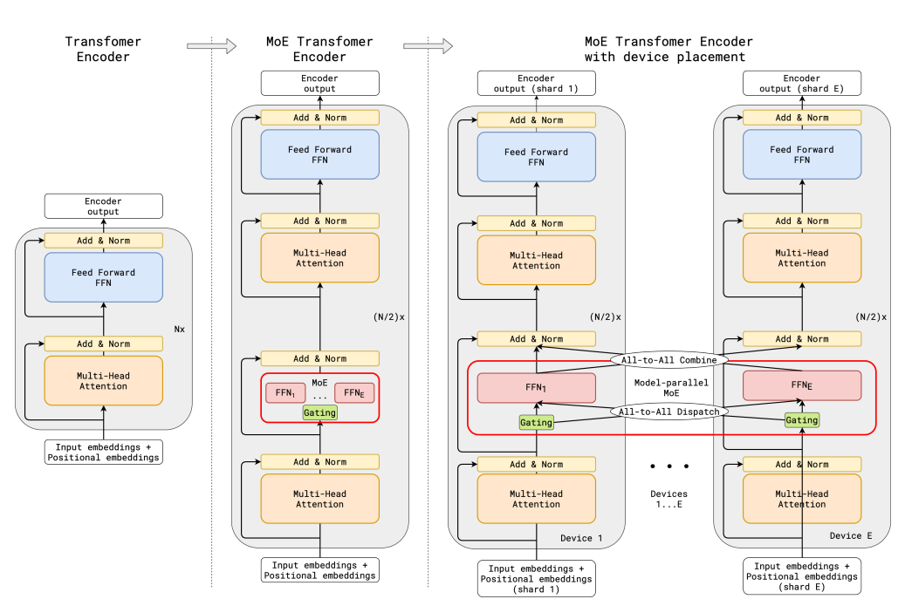
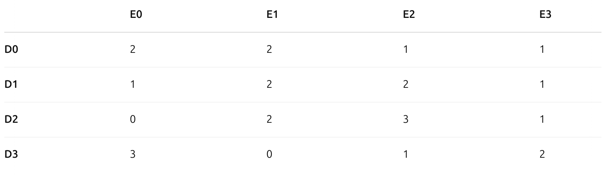
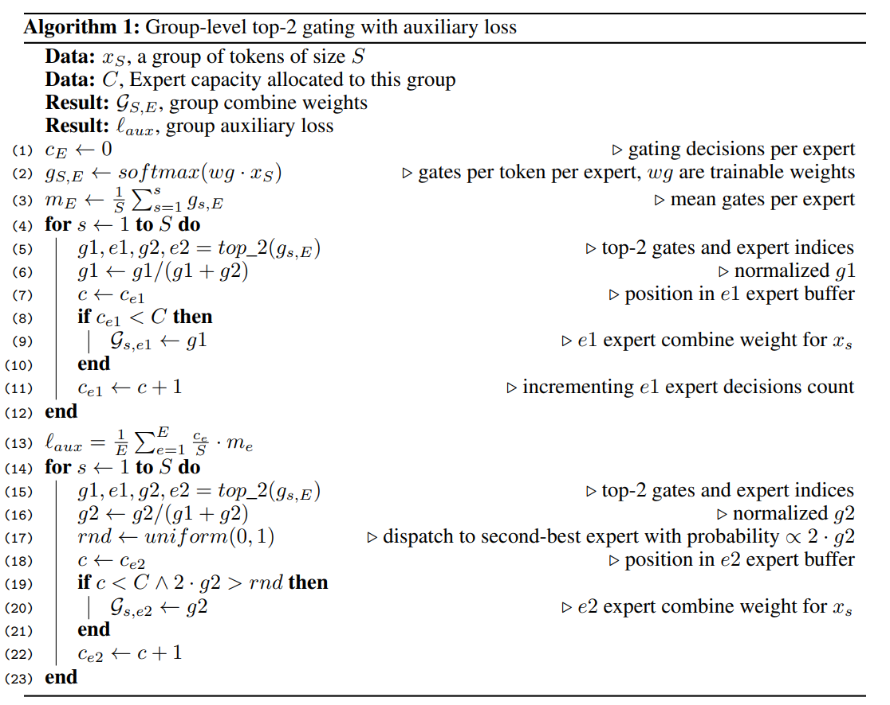
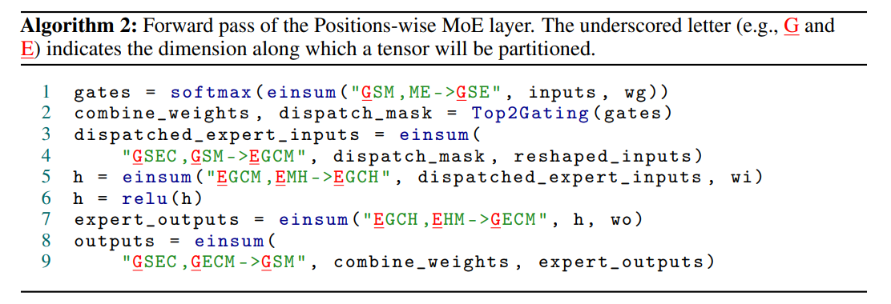
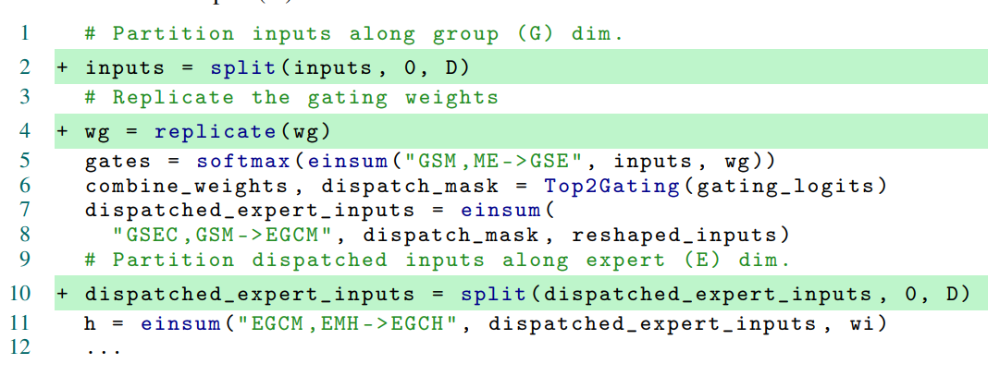
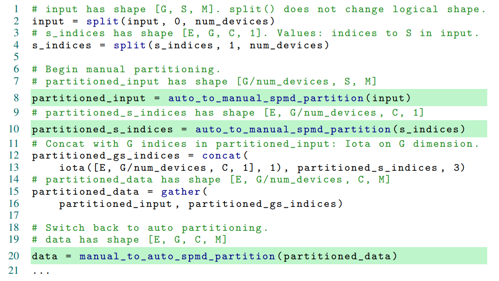
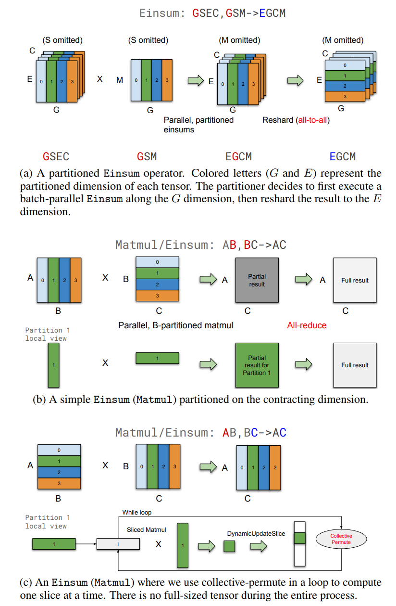
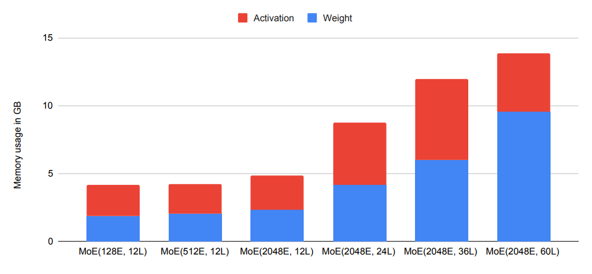

# GShard: Scaling Giant Models with Conditional Computation and Automatic Sharding ([ссылка](https://arxiv.org/pdf/2006.16668))

**Одна из первых работ по MoE-parallelism**

Интересная статья про [einsum](https://habr.com/ru/articles/544498/)

## Model

## Устройство архитектруы трансформера с MoE:

**Замечание:** Откуда берется All-To-All

Пусть у нас есть на каждом GPU ($D_i$) есть определенное число токенов: $S$ (пусть 6)

Пусть после прохождения через $GATE$ мы получили вектор того, куда небоходимо отправить токены (если Top-2, то просто будет 2 All-To-All). Отсортируем наши токены в сооответсвии с этим вектором и рангом GPU на котором лежит нужный нам эксперт ($E_j$). Тогда пересылку можно записать в виде таблицы:

(здесь на пересечении стоит количетсво токенов, которое можно отправить, но также можно было и написать сам список токенов)

Далее операция All-To-All - это по сути транспонипрование этой матрицы. All-To-All Dispatch - первое транспонирование этой матрицы. Тем самым нужные токены отправлены нужны экспертам. Затем All-To-All Combine это по сути операция, которая возвращает нашу матрицу в исходный вид.

**Используется стандартная архитектура MoE с Top-2 экспертами**

$$
G_{s,E}=GATE(x_s) \ (1) \\
FFN_e(x_s)=wo_eReLU(wi_ex_s) \ (2) \\
y_s=\sum\limits_{e=1}^EG_{s,e}FNN_e(x_s) \ (3)
$$

$x_s$ - входной токен на слое MoE

Функция стробирования GATE(·) имеет решающее значение для уровня MoE, который моделируется функцией активации softmax для указания весов каждого эксперта при обработке входящих токенов. Другими словами, чтобы указать, насколько хорошо эксперт справляется с обработкой поступающего токена. Кроме того, функция стробирования должна удовлетворять двум целям:

 1. **Сбалансированная нагрузка**. 

    Предпочтительно, чтобы выбирались лишь несколько экспертов для каждого токена. Наивным решением было бы просто выбрать топ-k экспертов в соответствии с распределением вероятностей softmax. Тем не менее, известно, что такой подход приводит к проблеме дисбаланса нагрузки при обучении: большинство токенов, наблюдаемых во время обучения, были бы отправлены небольшому количеству экспертов, накапливая очень большой входной буфер только для нескольких (занятых) экспертов, оставляя других экспертов необученными, замедляя обучение. Между тем, многие другие специалисты вообще не получают достаточной подготовки. Более совершенная конструкция функции литникования позволила бы более равномерно распределить нагрузку на обработку между всеми специалистами.
 2. **Эффективность в масштабе**.
 
    Добиться сбалансированной нагрузки было бы довольно тривиально, если бы функция стробирования выполнялась последовательно. Стоимость вычислений только для функции стробирования составляет не менее O(NE) для всех N токенов во входном пакете с учетом экспертов E. Однако в нашем исследовании N находится в порядке миллионов, а E — в порядке тысяч, последовательная реализация функции стробирования привела бы к тому, что большая часть вычислительных ресурсов простаивала бы большую часть времени. Следовательно, нам нужна эффективная параллельная реализация функции стробирования для использования большого количества устройств
  
Для решения этих проблем предусмотрены следующие оптимизации:

 1. **Expert capacity**

    Для обеспечения балансировки нагрузки мы устанавливаем, что количество токенов, обрабатываемых одним экспертом, не превышает некоторый универсальный порог, который мы определяем как *вместимость эксперта*. Предполагая, что общее количество токенов в обучающем батче равно $N$, и каждый токен направляется не более чем к двум экспертам, тогда вместимость эксперта устанавливается как $O(N/E)$. Функция $\text{GATE}(·)$ ведёт текущий счётчик $c_e$ для учёта количества токенов, направленных к эксперту. Если оба эксперта, выбранные токеном, уже исчерпали свою вместимость, токен считается *переполненным* (overflowed), и $G_{s,E}$ вырождается в нулевой вектор. В этом случае представление токена $x_s$ передаётся на следующий слой через остаточные соединения (residual connections).

 2. **Local group dispatching**

    Функция $\text{GATE}(·)$ равномерно разделяет все токены обучающего батча на $G$ групп, где каждая группа содержит $S = N/G$ токенов. Все группы обрабатываются независимо и параллельно. Каждой группе выделяется дробная вместимость каждого эксперта, равная $2N/(G \cdot E)$. Это гарантирует, что в каждого эксперта будет направлено не более указанного количества токенов из группы. Таким образом, обеспечивается соблюдение вместимости экспертов и балансировка общей нагрузки.

 3. **Auxiliary Loss**
 
    Важно, чтобы функция маршрутизации не всегда выбирала одних и тех же экспертов, так как это приведёт к переполнению их вместимости при недозагрузке остальных. Следуя, мы определяем вспомогательный член потерь $l_{aux}$ для обеспечения этого ограничения. Он добавляется к общей функции потерь модели $L = l_{nlt} + k \cdot l_{aux}$ с постоянным множителем $k$. Конкретная форма вспомогательного члена потерь $l_{aux}$ в строке (13) алгоритма 1 (ниже) мотивирована следующим соображением: член $c_e / S$ (по сути доля токенов, относительно группы, направленных конкретному эксперту) представляет долю входа, направленную к каждому эксперту, и мы хотим минимизировать средний квадрат $c_e / S$. Однако поскольку $c_e$ получен через операцию top-2 и не является дифференцируемым, мы используем дифференцируемую аппроксимацию - средние значения весов маршрутизации на эксперта $m_e$, заменяя $(c_e / S)^2$ на $m_e (c_e / S)$. Это позволяет оптимизировать выражение методом градиентного спуска.

 4. **Random Routing** 

    Интуитивно, поскольку $y_s$ представляет собой взвешенное среднее выходов выбранных экспертов, если вес второго эксперта очень мал, мы можем просто проигнорировать его для сохранения общей вместимости экспертов. Таким образом, помимо соблюдения ограничения на вместимость экспертов, функция $\text{GATE}(·)$ направляет токен ко второму эксперту (следующему по предпочтению) с вероятностью, пропорциональной его весу $g_2$

## Highly Parallel Implementation using GShard

### Positions-wise Mixture-of-Expert Layer Expressed in Linear Algebra

Реализация модели (Алгоритм 2) рассматривает весь кластер акселераторов как единое устройство и выражает его базовый математический алгоритм через несколько тензорных операций, независимых от конкретной конфигурации кластера. Нотация суммирования Эйнштейна - это мощная конструкция для лаконичного выражения модели, и мы используем её extensively в нашей реализации. 

Вычисление softmax-весов тривиально выражается одним einsum с последующим применением функции softmax. Распределение входов к выбранным экспертам выражается одним einsum между маской распределения и входом. Все веса $FFN_e$ объединены в единые 3D-тензоры $w1$ и $wo$, а вычисления $FFN_1...FFN_E$ выражены с использованием 3 операторов (два einsum и один relu). Наконец, взятие взвешенного среднего всех выходов экспертов в окончательный выход выражено ещё одним einsum.

Top2Gating в Алгоритме 2 вычисляет объединение всех группово-локальных $\mathcal{G}_{S,E}$, описанных в Алгоритме 1. combine\_weights - это 4D-тензор с формой [G, S, E, C]. Значение combine\_weights[g, s, e, c] ненулевое, когда входной токен $s$ в группе $g$ отправляется во входной буфер эксперта $e$ на позицию буфера $c$. Для конкретных g и s, срез combine\_weight[g, s, :, :] содержит не более двух ненулевых значений. Бинарная маска dispatch\_mask создаётся из combine\_weights простой установкой всех ненулевых значений в 1.

Нам нужно выбрать количество групп $G$ и количество экспертов $E$ правильно, чтобы алгоритм мог масштабироваться на кластере с $D$ устройствами. Стоит проанализировать его общую вычислительную сложность (общее количество операций с плавающей запятой) для шага обучения при заданном обучающем батче из $N$ токенов.

**Пояснение:**

**gates**: вспоминаем формулу $GATE(x)=softmax(xW_g)$, отсюда и получаем

**combine_weights**, **dispatch_mask**: просто получили маску и веса

**dispatch_experts_inputs**:

Рассмотрим:
$$
с[e,c,m]=\sum\limits_{s=1}^Sa[s,e,c]b[s,m]
$$

У нас $e,c$ - фиксированы => 1 или 0 обозначает, попадает ли токен $s$ на эксперта $e$ с индексом $c$. Если да, то при изменении $m$ будет менятся только число в векторе токена и оно будет переносится туда, куда нужно. Иначе вектор просто обнулится. Добавим еще координату $g$. Ну а перестановка $E, G$ - по сути операция транспонирования All-To-All

**h**: просто FFN слой, зафиксируем $e,g$ получим кмножение матриц

**expert_outputs**: аналогично + делаем еще один All-To-All

**outputs**: средневзвешенное

### Анализ сложности

Мы анализируем масштабирование вычислительной сложности Алгоритма 2 с числом устройств $D$ при следующих предположениях:  
a) количество токенов на устройстве $\frac{N}{D} = O(1)$ является константой¹;  
b) $G = O(D)$, $S = O(1)$ и $N = O(GS) = O(D)$;  
c) $M = O(1)$, $H = O(1)$;  
d) $E = O(D)$; и e) $C = O(\frac{2S}{E}) = O(\frac{1}{D})$, $D < S$ и является положительным целым числом².  

Общее количество операций с плавающей запятой $FLOPS$ в Алгоритме 2:

$$FLOPS_{\text{Softmax}} + FLOPS_{\text{Top2Gating}} + FLOPS_{\text{DispatchCombine}} + FLOPS_{\text{FFN}} = O(GSME) + O(GSEC) + O(GSMEC) + O(EGCHM) =$$

$$O(D \cdot 1 \cdot 1 \cdot D) + O(D \cdot 1 \cdot D \cdot \frac{1}{D}) + O(D \cdot 1 \cdot 1 \cdot D \cdot \frac{1}{D}) + O(D \cdot D \cdot \frac{1}{D} \cdot 1 \cdot 1) =$$

$$O(D^2) + O(D) + O(D) + O(D)$$

и, следовательно, на устройство $FLOPS/D = O(D) + O(1) + O(1) + O(1)$. Сложность softmax на устройство $FLOPS_{\text{softmax}}/D = O(D)$ линейна по числу устройств, но на практике доминируется другими слагаемыми, поскольку $D \ll H$ и $D < S$. В результате $FLOPS/D$ можно считать $O(1)$, что удовлетворяет требованиям сублинейного масштабирования. В разделе 5 этот анализ подтверждается эмпирически.

В дополнение к вычислительным затратам, у нас есть непостоянные затраты на межустройственную коммуникацию, но они растут с умеренной скоростью $O(\sqrt{D})$ при увеличении $D$.

### GShard Annotation API for Parallel Execution

Из-за огромного размера и вычислительных ресурсов тензоров в алгоритме 1 нам приходится распараллеливать алгоритм на многих устройствах. Непосредственное решение о том, как сегментировать каждый тензор в алгоритме, проиллюстрировано подчеркнутыми буквами в алгоритме 2. API шардинга в GShard позволяет нам аннотировать тензоры в программе, чтобы выборочно указать, как они должны быть разделены. Эта информация передается компилятору, чтобы компилятор мог автоматически применять преобразования для параллельного выполнения.

**API**:

 - **replicate(tensor)** аннотирует тензор, который должен быть реплицирован между секциями, и возвращает аннотированный тензор. Это часто используется для слоев, не относящихся к MoE в нашей модели, для репликации весов.
 - **split(tensor, split_dimension, num_partitions)** аннотирует тензор, который должен быть секционирован вдоль split_dimension, и возвращает аннотированный тензор. Раздел i размещается на i-м устройстве, и num_partitions не должен превышать количество устройств в системе.
 - **-shard(tensor, device_assignment)** обобщает split(), чтобы обеспечить секционирование нескольких измерений и указание размещения каждой секции.

На основе этих API получаем следующий код:

**Шардинг (разделение) тензоров**  
Как показано в примере выше, пользователям не требуется аннотировать каждый тензор в программе. Аннотации обычно нужны только для нескольких важных операторов, таких как операции Einsum в нашей модели, а компилятор использует собственные эвристики для определения шардинга остальных тензоров \(^3\). Например, если входной тензор разделён по измерению $G$, а весовой тензор реплицирован, компилятор выбирает разделение выхода операции einsum по тому же измерению $G$ (строка 5). Аналогично, если оба входа разделены по измерению $G$ для операции einsum при диспетчеризации входных данных (строка 7), шардинг вывода определяется как разделённый по измерению $G$, после чего мы добавляем аннотацию разделения на выходе для перераспределения данных по измерению $E$. Некоторые аннотации в приведённом примере также могут быть определены компилятором (например, `replicate(wg)`), но рекомендуется аннотировать начальные входные и конечные выходные тензоры вычислений.

В настоящее время компилятор использует итеративный анализ потока данных для распространения информации о шардинге от оператора к его соседям (операндам и пользователям), начиная с аннотированных пользователем операторов. Анализ пытается минимизировать вероятность перераспределения данных, согласовывая решения о шардинге для смежных операторов. 

**Совмещение ручного и автоматического шардинга**  
Автоматическое разделение с помощью шардинг-аннотаций часто достаточно для стандартных случаев, но GShard также предоставляет гибкость для совмещения вручную разделённых операторов с автоматически разделёнными. Это даёт пользователям больше контроля над тем, как операторы разделяются, и один из примеров — когда пользователь обладает дополнительной информацией во время выполнения, выходящей за рамки семантики операторов. Например, ни в определении оператора Gather в XLA, ни в TensorFlow не передаётся информация о границах индексов для различных диапазонов во входных данных, но пользователь может знать, что конкретный оператор Gather перемешивает данные только в пределах каждого раздела. В этом случае пользователь может легко разделить оператор, просто уменьшив размер измерения и выполнив локальный Gather; в противном случае компилятору пришлось бы действовать консервативно в отношении диапазона индексов и добавлять издержки на коммуникацию. Например, оператор диспетчеризации Einsum (строка 3) в Алгоритме 2, который использует one-hot матрицу для диспетчеризации входных данных, может быть альтернативно реализован с помощью оператора Gather с использованием простого ручного разделения, в то время как остальная часть модели разделяется автоматически. Ниже приведен псевдокод, иллюстрирующий этот случай использования.

### The XLA SPMD Partitioner for GShard

Этот раздел описывает инфраструктуру компилятора, которая автоматически разделяет вычислительный граф на основе аннотаций шардинга. Аннотации шардинга сообщают компилятору о том, как каждый тензор должен быть распределен по устройствам. SPMD (Single Program Multiple Data) партиционер (или просто "партиционер" для краткости) - это компонент компилятора, который преобразует вычислительный граф в единую программу для выполнения на всех устройствах параллельно. Это делает время компиляции почти постоянным независимо от количества разделов, что позволяет нам масштабироваться до тысяч партиций⁴.

Мы реализовали партиционер в компиляторе XLA. XLA имеет гораздо меньший набор операторов по сравнению с популярными интерфейсными фреймворками, такими как TensorFlow, что снижает нагрузку на реализацию партиционера без ущерба для общности, поскольку существующее преобразование из интерфейсных фреймворков выполняет основную работу, чтобы сделать его выразительным..

XLA моделирует вычисления как граф потока данных, где узлы - это операторы, а ребра - тензоры, передаваемые между операторами. Основой партиционера является обработка каждой операции, которая преобразует оператор полного размера в оператор размера партиции в соответствии с шардингом, указанным на входе и выходе. Когда вычисления разделены, вводятся различные шаблоны передачи данных между устройствами. Чтобы максимизировать производительность в больших масштабах, необходимо определить базовый набор коммуникационных примитивов и оптимизировать их для целевой платформы.

**Коммуникационные примитивы**

 - CollectivePermute

   Этот оператор определяет список пар "источник-назначение", где входные данные от источника отправляются соответствующему получателю.
 - AllGather
 - AllReduce
 - AllToAll

Распространение шардинга отдаёт приоритет выбору одинакового шардинга для батч-измерений LHS, RHS и вывода, потому что это позволило бы избежать любой межраздельной коммуникации. Однако это не всегда возможно, и нам нужна межраздельная коммуникация в следующих трёх случаях.

- **Перешардинг.** В построенной MoE-модели логика диспетчеризации экспертов (Строка 3 в Алгоритме 2) требует переключения разделяемого измерения после Einsum. Поскольку перешардинг эффективен с AllToAll, мы сначала выполняем Einsum локально, затем переразделяем его на нужное измерение, как показано на Рисунке a.

- **Накопление частичных результатов.** Если входы разделены по сокращающимся измерениям, локальный результат является частичным, и нам нужно использовать AllReduce, чтобы объединить их и получить конечный результат, как показано на Рисунке b.
- **Разделение в цикле.** Для определённых сценариев мы также реализовали алгоритм, аналогичный алгоритму Кэннона , чтобы ограничить размер тензоров в каждом разделе. Например, если оба операнда разделены по несокращающемуся измерению, мы не можем вычислить локальный Einsum напрямую, поскольку операнды имеют разные несокращающиеся измерения. Репликация одного из операндов не вызовет избыточных вычислений, но требует, чтобы реплицируемый операнд помещался в память устройства. Поэтому, если размер операнда слишком велик, мы вместо этого сохраняем оба операнда разделёнными и используем цикл для итерации по каждому срезу результата, а также применяем CollectivePermute для обмена входными срезами (Рисунок c).

## Performance and Memory Consumption

Наши измерения и анализ показывают, что потребление памяти устройством примерно постоянно, когда мы увеличиваем количество устройств и экспертов, а время шага растет сублинейно, т. е. время выполнения увеличивается в 1,7 раза, когда мы масштабируем модель в 16 раз со 128 устройств до 2048 устройств. 

### Memory Efficiency and Scalability

В модели GShard существует три основных типа использования памяти, все из которых имеют постоянный размер на устройство после SPMD-разделения при увеличении количества экспертов.

- Реплицированные веса (например, feed-forward слои трансформера).
- Распределенные веса (feed-forward слои MoE.
- Активации (выход каждого слоя, используемый как в прямом, так и в обратном проходе).

Масштабирование памяти как $O(1)$ демонстрируется на Рисунке ниже, который показывает распределение использования памяти на устройство для разных моделей. При фиксированном количестве слоев как память для весов, так и память для активаций остаются постоянными при увеличении количества экспертов.

С другой стороны, и память для весов, и память для активаций масштабируются линейно с количеством слоев. Когда требования к памяти превышают доступную память на каждом устройстве, компиляторная рематериализация автоматически пересчитывает часть активаций в обратном проходе, чтобы уменьшить пиковое использование памяти для активаций. Именно поэтому размер активаций для MoE(2048E, 60L) меньше, чем для MoE(2048E, 36L). Накладные расходы на рематериализацию также оптимизированы: например, только 28% и 34% общего количества циклов тратится на пересчет для моделей 36L и 60L соответственно, и 0% для 12L и 24L, так как они помещаются в память устройства без рематериализации.

### Runtime Efficiency and Scalability

На Рисунке ниже показана разбивка времени выполнения для слоя MoE и соседнего слоя Transformer. Также проводится сравнение достигнутой производительности с теоретическим пределом ("roofline"), который оценивается путем предположения, что операции, ограниченные вычислениями, памятью или коммуникациями, могут достигать 100% пиковой производительности FLOPS, пропускной способности памяти или пропускной способности межсоединений. Это очень оптимистичная оценка, поскольку многие операторы ограничены смешанным набором ресурсов. При меньшем масштабе (128 экспертов) наша модель может достигать >70% от теоретического предела производительности. Время выполнения на устройстве увеличивается в 1.7 раза при масштабировании модели в 16 раз больше (2048 экспертов), и все равно может достигать 48% от теоретического предела производительности.

Слои трансвормера достигают только более 30% производительности от пиковой мощности, а Moe > 85%

**Gate computation**. Первый Einsum — это проекция, которая вычисляет входные данные для каждого эксперта в softmax. У него есть стоимость O(D), но это очень маленькая часть слоя. Два других Einsums — это отправка токенов и объединение экспертных результатов. Они эффективно реализуют Gather с одногорячими матрицами, которые стоят дороже, но с постоянной стоимостью O(GC) = O(1), которая не зависит от количества экспертов. Время выполнения этих Einsum увеличивается примерно в 2 раза, когда мы масштабируемся со 128 до 2048 экспертов (в 16 раз).

Оставшиеся вычисления для каждого устройства включают в себя множество вычислений общего назначения, таких как ArgMax и Cumsum, которые либо ограничены памятью, либо даже последовательны по своей природе, поэтому не предназначены для эффективного использования TPU. Большая часть времени тратится на последовательные операции Cumsum по инвертированию матриц с одним горячим, представляющими выбранных экспертов для каждого токена, в матрицы с одним горячим, представляющими подобранные токены для каждого эксперта. Линейная сложность кумсума показана на рисунке ниже. Эта часть вычисления стробирования также имеет стоимость O(D), но, к счастью, как и Einsum до softmax, она имеет очень маленький постоянный коэффициент. Он имеет незначительное время выполнения со 128 экспертами и занимает менее 10% от общего времени, затраченного на уровни MoE и Transformer с 2048 экспертами.

Наиболее важной частью стробирования является коммуникация, которая показана на рисунке 8 как «Отправка и объединение MoE». Это операторы AllToAll, и, как мы обсудим в разделе 5.3, их стоимость составляет O( √ D). Когда число экспертов увеличивается в 16 раз со 128 до 2048, время выполнения увеличивается примерно в 3,75 раза, а их доля времени выполнения в МО и Трансформере увеличивается с 16% до 36%.

