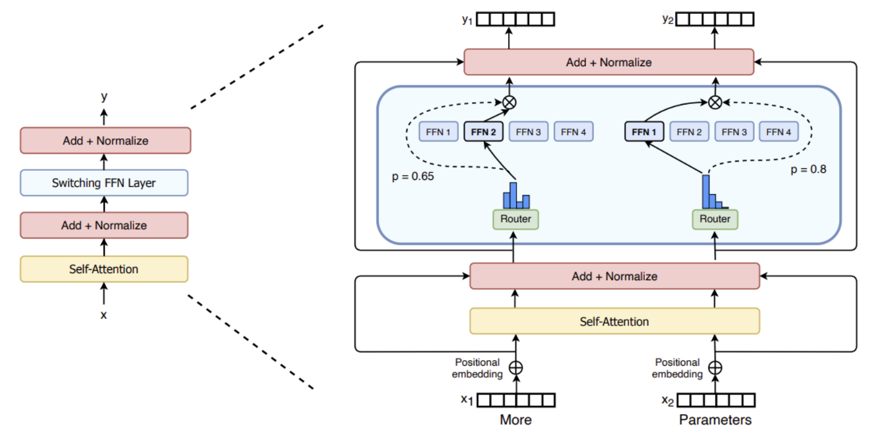
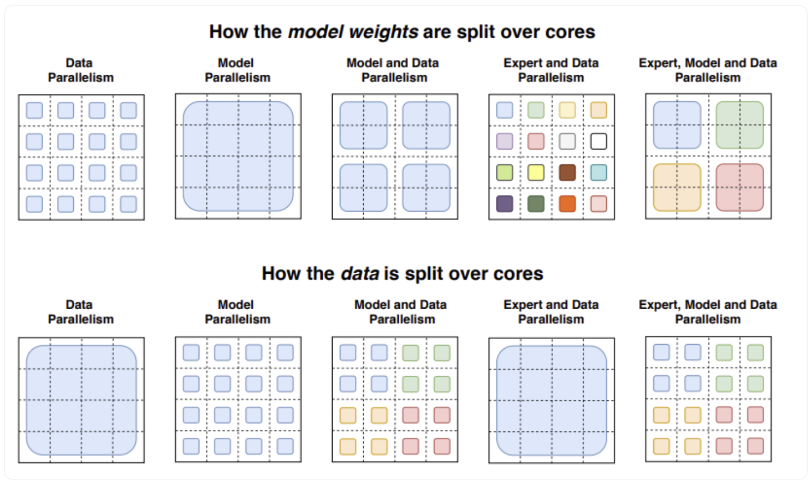

# [Что такое MoE-параллелизм?](https://huggingface.co/blog/moe)

Масштаб модели является одной из наиболее важных осей для улучшения качества модели. При фиксированном вычислительном бюджете обучение модели большего размера за меньшее количество шагов лучше, чем обучение модели меньшего размера за большее количество шагов.

**MoE** позволяет предварительно обучать модели с гораздо меньшими вычислительными ресурсами, что означает, что вы можете значительно увеличить размер модели или набора данных с тем же вычислительным бюджетом, что и плотная модель. В частности, модель MoE должна достигать того же качества, что и ее плотный аналог во время pretraining.

В контексте моделей трансформеров MoE состоит из двух основных элементов:

 1. Вместо слоев плотной сети прямой связи (FFN) используются **разреженные слои MoE**. В слоях MoE есть определенное количество «экспертов» (например, 8), где каждый эксперт является нейронной сетью. На практике экспертами являются FFN, но они также могут быть более сложными сетями или даже самим MoE, что приводит к иерархическим MoE!
 2. **Network gate или router**, который определяет, какие токены отправляются какому эксперту. Например, на изображении ниже токен "More" отправляется второму эксперту, а токен "Parameters" отправляется в первую сеть. Как мы узнаем позже, мы можем отправить токен более чем одному эксперту. Как направить токен эксперту - одно из важных решений при работе с MoE - маршрутизатор состоит из изученных параметров и предварительно обучен одновременно с остальной сетью.

 

### Проблемы MoE

 1. **Training**:MoE позволяют значительно повысить эффективность вычислений при предварительном обучении, но исторически сложилось так, что они испытывали трудности с обобщением во время тонкой настройки, что приводило к переобучению.
 2. **Inference**: Несмотря на то, что MoE может иметь много параметров, только некоторые из них используются при выводе. Это приводит к гораздо более быстрому выводу по сравнению с плотной моделью с тем же количеством параметров. Однако все параметры должны быть загружены в оперативную память, поэтому требования к памяти высоки. Например, для такого MoE, как Mixtral 8x7B, нам потребуется достаточно видеопамяти для хранения модели с плотными параметрами 47B. Почему параметры 47B, а не 8x7B = 56B? Это связано с тем, что в моделях MoE только слои FFN рассматриваются как отдельные эксперты, а остальные параметры модели являются общими. В то же время, предполагая, что на один токен используется только два эксперта, скорость вывода (FLOP) аналогична использованию модели 12B (в отличие от модели 14B), поскольку она вычисляет умножение матриц 2x7B, но с некоторыми общими слоями.

 **Пояснение:**
    При инференсе мы используем только некоторых экспертов, к примеру 2. Если мы посмотрим на рисунок выше, то увидим, что у экспертов некоторые слои общие => нужно будет в неоторых частях производить только 1 раз вычисления, вместо 2.

## What is Sparcity?

Sparsity использует идею условных вычислений. В то время как в плотных моделях все параметры используются для всех входных данных, разреженность позволяет нам запускать только некоторые части всей системы. Идея условных вычислений (части сети активны на основе каждого примера) позволяет масштабировать размер модели без увеличения вычислений, и это привело к тому, что на каждом уровне MoE использовались тысячи экспертов.

Такая конфигурация сопряжена с некоторыми проблемами. Например, несмотря на то, что большие пакеты обычно лучше для производительности, **размеры пакетов в MoE эффективно уменьшаются по мере того, как данные проходят через активных экспертов**. Например, если наш пакетный ввод состоит из 10 токенов, пять токенов могут быть отданы одному эксперту, а остальные пять токенов могут бать отданы пятью разным экспертам, что приведет к неравномерному размеру пакетов и недоиспользованию.

Решить эту проблему можно с помощью специальной сети **network gate (G)**, которая будет определять, каким экспертам (E) следует отправлять части входных данных:

$$
y=\sum\limits_{i=1}^nG(x)_iE_i(x) \ (1)
$$

В этой конфигурации все эксперты запускаются для всех входных данных - это взвешенное умножение. Но что произойдет, если $G(x)_i=0$? В этом случае нет необходимости вычислять соответствующие экспертные операции, и, следовательно, мы экономим вычисления. В качетсве **Network Gate** можно использовать функцию softmax:
$$
G_{\sigma}(x)=Softmax(x*W_g) \ (2)
$$

Но можно использовать сеть немного другого вида. Можно добавить немного шума, а затем сохранить топ k значений.

$$
H(x)_i=(x*W_g)+StandardNormal()*Softplus((x*W_{noise})_i) \ (3) \\
\begin{equation*}
KeepTopK(v_i,k)_i =  
\begin{cases}
    v_i &v_i \text{в топ k элементов}\\
   -\infty &\text{иначе}
 \end{cases}

\end{equation*} \ (4)
$$
И уже к этому применить Softmax:

$$
G(x) = Softmax(KeepTopK(H(x), k)) \ (5)
$$

Эта разреженность привносит некоторые интересные свойства. Используя достаточно низкое k (например, один или два), мы можем обучать и запускать вывод гораздо быстрее, чем если бы было активировано много экспертов. Почему бы просто не выбрать топового эксперта? Первоначальная гипотеза заключалась в том, что маршрутизация к более чем одному эксперту была необходима, чтобы network gate научилась направлять к разным экспертам, поэтому необходимо было выбрать как минимум двух экспертов.

## Load balancing tokens for MoEs

Как уже говорилось ранее, если все наши токены будут отправлены всего нескольким популярным экспертам, это сделает обучение неэффективным. При обычном обучении МО сеть стробирования сходится, чтобы в основном активировать одних и тех же нескольких экспертов. Это самоусиливается, поскольку привилегированные эксперты обучаются быстрее и, следовательно, отбираются больше. Чтобы смягчить эту проблему, добавляются **вспомогательные потери**, чтобы стимулировать придание всем экспертам одинаковой важности. Эта потеря гарантирует, что все эксперты получат примерно равное количество обучающих примеров. В следующих разделах также будет рассмотрена концепция емкости эксперта, которая вводит порог того, сколько токенов может быть обработано экспертом. 

## Parallelism Moe
 1. Data Parallelism
 2. Model Parallelism
 3. DP + MP
 4. Expert Parallelism: эксперты расставляются по разным работникам. В сочетании с параллелизмом данных у каждого ядра есть отдельный эксперт, и данные секционируются по всем ядрам

 При экспертном параллелизме эксперты размещаются на разных исполнителях, и каждый работник берет свою партию обучающих выборок. Для слоев, отличных от MoE, экспертный параллелизм ведет себя так же, как и параллелизм данных. Для слоев MoE токены в последовательности отправляются исполнителям, в которых находятся нужные эксперты.

 

## Serving techniques (это нужно хорошо изучить)

Большим недостатком MoE является большое количество параметров. Для локальных сценариев использования можно использовать модель меньшего размера. Давайте кратко обсудим несколько приемов, которые могут помочь с подачей.

 1. Авторы «switch transformers» проводили ранние эксперименты по дистилляции. Перегоняя MoE обратно в его плотный аналог, они могут сохранить 30-40% прироста разреженности. Таким образом, дистилляция обеспечивает преимущества более быстрого удержания и использования в производстве модели меньшего размера.
  2. Современные подходы изменяют маршрутизацию для маршрутизации полных предложений или задач к эксперту, что позволяет извлекать подсети для обслуживания.
  3. Агрегирование экспертов (MoE): этот метод объединяет веса экспертов, тем самым уменьшая количество параметров во время вывода.

