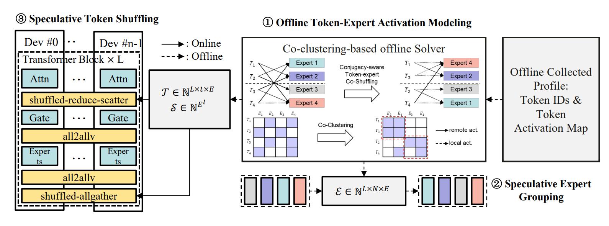
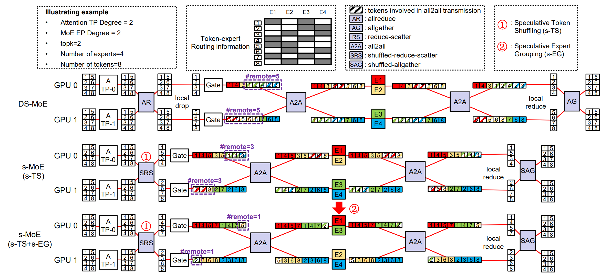
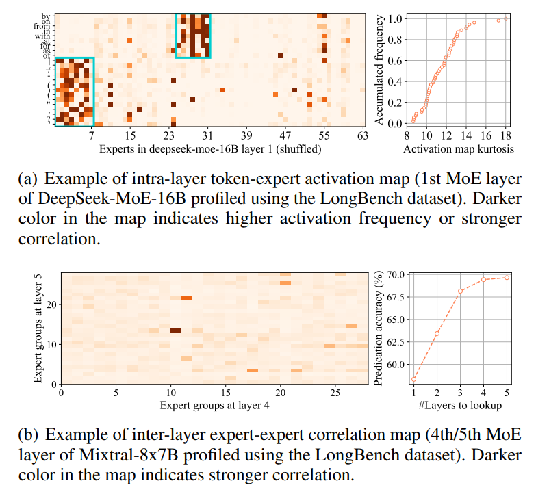
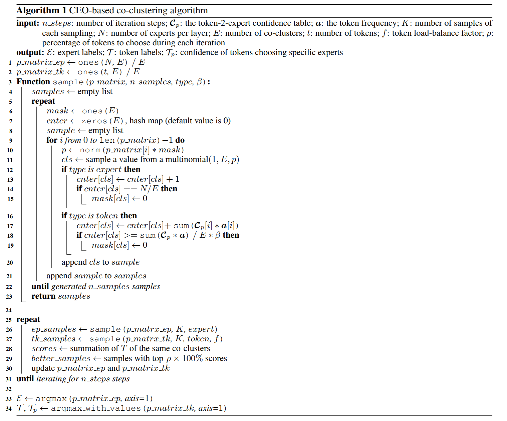
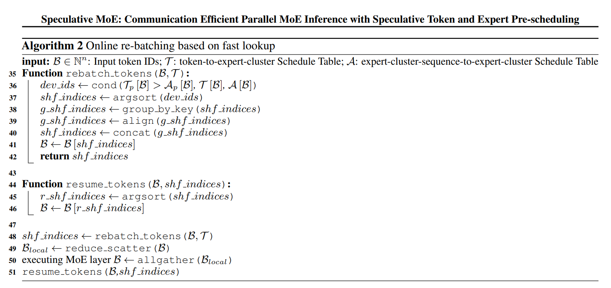

# Speculative MoE: Communication Efficient Parallel MoE Inference with Speculative Token and Expert Pre-scheduling [ссылка](https://arxiv.org/pdf/2503.04398)

В этом исследовании мы показываем, что коммуникационные затраты парадигмы параллельного вывода DeepSpeed-MoE (EP+TP) могут быть без потерь снижены путем переработки её статической детерминированной схемы параллелизации в новую динамическую спекулятивную схему, которая исследует и прогнозирует пути маршрутизации (или активации) экспертов для отдельных outstanding токенов и проактивно перемешивает токены и экспертов, чтобы уменьшить избыточную коммуникацию EP и TP. Мы назвали нашу спекулятивную инференс-структуру Спекулятивное MoE (s-MoE); s-MoE имеет два спекулятивных механизма: Спекулятивное Перемешивание Токенов (s-TS) и Спекулятивную Предварительную Группировку Экспертов (s-EG).

Сначала в онлайн-режиме s-TS заранее частично перемешивает активации ожидаемых токенов между GPU-устройствами на этапе тензорного параллелизма (TP), пытаясь разместить активации токенов вместе с их предсказанными экспертами для последующей маршрутизации в рамках параллелизма экспертных моделей (EP). В частности, s-TS преобразует операцию allreduce из реализации MoE в DeepSpeed так, чтобы она выполнялась через новый коммуникационный примитив под названием shuffled-reduce-scatter, который без потерь объединяет процесс спекулятивного перемешивания токенов с операцией reduce-scatter. И, к тому же, позволяет удалить одну операцию AllGather. Однако подход s-TS, основанный на возможностях для оптимизации, не позволяет сократить объём коммуникации, если предсказания маршрутов активации экспертов оказываются ошибочными, а также в случае, когда маршрутизируемые эксперты (для отдельных токенов) распределены по многим разным GPU-устройствам и серверам. Это особенно актуально для MoE-моделей с большим количеством небольших экспертов. Чтобы справиться с первой проблемой, s-TS обучает точные вероятностные модели, проводя обширные предварительные тесты, а для решения второй проблемы он полагается на предварительную группировку экспертов.

Во-вторых, в оффлайн-режиме, чтобы уменьшить вероятность рассредоточения экспертов, метод s-EG заранее кластеризует экспертов, которые могут быть активированы одним токеном или группой семантически связанных токенов, на одно и то же устройство или сервер, основываясь на предсказанных маршрутах "токен–эксперт". Мы выполняем предварительную группировку экспертов периодически в оффлайн-режиме, поскольку кластеризация и распределение экспертов требуют решения сложных задач оптимизации и могут привести к значительному объёму обмена параметрами через сеть. Оба этих процесса неуместны во время реального инференса.

## s-MoE: overview

Рисунок ниже показывает рабочий процесс s-MoE, где жирные линии и пунктирные линии обозначают онлайн- и офлайн-операции. Сначала s-MoE собирает профили активации токенов, включая идентификаторы токенов и частоты активации экспертов (① на Рисунке ниже). s-MoE вероятностно моделирует вероятность маршрутизации токенов к экспертам и решает задачу сбалансированного когруппирования токенов и экспертов, чтобы создать подсказки для совместного планирования. Эти подсказки включают легковесные таблицы поиска (таблица токен-эксперт-кластер T и таблица эксперт-кластер-последовательность-эксперт-кластер S) и таблицы группировки экспертов E. Таблицы T и S используются в ядре SRS (shuffled-reduce-scatter) и SAG (shuffled-allgather) (т.е., предположительная перетасовка токенов, s-TS, ② на Рисунке ниже). E используется для предположительной перетасовки экспертов, s-EG (③ на Рисунке ниже).

Рисунок ниже иллюстрирует пример работы s-MoE. В базовом DS-MoE (первый ряд), токены синхронизируются оператором allreduce и частично отбрасываются перед модулем ворот. После того, как решено, какой эксперт активировать, токены отправляются на соответствующие устройства для вычислений эксперта. Затем токены возвращаются, локально объединяются и собираются. После применения s-TS (второй ряд), каждый токен предсказывается заранее, к какому эксперту он будет направлен перед модулем ворот. Затем токены перетасовываются и рассылаются в их соответствующие экспертные группы через оператор SRS (① на Рисунке ниже), что уменьшает объем общения all2all за счет увеличения локальной активации. Далее, при применении s-EG (третий ряд), эксперты офлайн перетасовываются с токенами (② на Рисунке ниже), что позволяет s-TS достичь еще более высокой локальной активации. В примере количество удаленно активированных токенов сокращается с 5 до 3, а затем до 1 после применения s-TS и s-EG. Мы детально анализируем производительность и алгоритмы s-TS и s-EG в следующих подразделах.

## Performance Analysis - s-TS and s-EG

Мы выводим теоретический объем экономии коммуникаций при переходе на динамические спекулятивные схемы s-TS и s-EG следующим образом. Мы используем символ $ν[...]$ для обозначения объем связи под гиперпараметрами [...].

**Preliminary 1: communication volume of reduction collectives**

Предположим, есть $G$ устройств, глобальный размер батча и последовательности равны $B$ и $S$. Объем связи allreduce, allgather, reduce-scatter определяется следующими формулами: 
$$
ν_{G,B,S}(AR) = \frac{2(G−1)BS}{G}, \\
ν_{G,B,S}(AG) = \frac{(G−1)BS}{G}, \\
ν_{G,B,S}(RS) = \frac{(G−1)BS}{G}.
$$

**Preliminary 2: communication volume of the p2p collectives**

Мы определяем процент обработанных токенов местными экспертами как локальный коэффициент активации $(α)$, а количество экспертов, к которым маршрутизируется каждый токен, обозначим как k. Объем связи all2all задается $$ν_{G,B,S,k,α}(A2A) = \frac{(1-α)kBS}{G}.$$

Рисунок выше сравнивает s-MOE с DS-MoE. Мы сосредотачиваемся на объеме связи TP внимания и EP MoE. Мы подразумеваем, что степень DP внимания и степень TP MoE равны 1. Коммуникационная схема DS-MoE выглядит следующим образом: $AR → A2A → A2A → AG$. Мы предполагаем, что усредненная локальная скорость активации A2A в DS-MoE равна $\frac{1}{G}$. Тогда объем связи DS-MoE-EP задается следующим образом: 
$$
ν_{G,B,S(AR)} + 2ν_{G,B,S,k,\frac{1}{G}}(A2A) + ν_{G,B,S}(AG) = \frac{3BS(G−1)}{G} + 2\frac{BSk(G−1)}{G^2} = BS(3 − \frac{1}{G} − \frac{2}{G^2} )(*) (BS(3+\frac{2k(1-\alpha)-3}{G})).
$$

Для s-MoE коммуникационная схема выглядит следующим образом: $SRS → A2A → A2A$, и объем связи задается формулой: 
$$
ν_{G,B,S}(RS) + 2ν_{G,B,S,k,α}(A2A) = \frac{BS(G−1)}{G} + \frac{2BSk(1−α)}{G} = BS(1 + \frac{2k(1−α)−1}{G})(**).
$$

Можно вывести, что объем экономии на коммуникациях s-MoE по сравнению с DS-MoE-EP и SGLang-EP составляет $BS(2 − \frac{2k(1−α)+ \frac{2}{G}}{G} )$ и $BS(3 − \frac{2k(1−α)+3}{G} )$. При локальной скорости активации, $α$, варьирующейся от 0 до 1, отношение объема экономии на коммуникациях колеблется от 32% до 75% и от 16% до 69%. 

Пояснение: Первую получили, путем (*) - (**), аналогично можно найти для второй

Следовательно, высокая локальная скорость активации α может значительно сократить затраты на коммуникацию, что можно достичь путем правильного совместного кластеризования токенов и экспертов на одном устройстве. Наше предложение s-MOE реализует такую идею, спекулятивно перемещая токены на лету с помощью s-TS, вместе с оффлайн предгруппировкой экспертов от s-EG, чтобы достичь более высокой локальной скорости активации, как будет подробно описано далее.

### Predicting Expert Routing Path

В общем, маршрутизация токена $x_j$ к $k$ экспертам в $L$-ом слое MoE регулируется сетью gating, выраженной как 
$$
G_L(h_{L,j}) = top-k(softmax(W_{L,g}h_{L,j} + b_{L,g}))
$$
где $h_{L,j}$ является семантическим представлением токена $x_j$, обработанным более ранними слоями вместе с его предшествующими токенами (контекст), $W_{L,g}$ и $b_{L,g}$ являются обучаемыми параметрами, а операция top-k выбирает K наиболее релевантных экспертов. Эта формулировка указывает на то, что выбор экспертов на уровне $L$ определяется как токеном $x_j$, так и его контекстом, что приводит к внутрислоевому аффинитету токен-эксперт . Более того, выбор экспертов для $x_j$ на предыдущих слоях также определяется $x_j$ и его контекстом, что последовательно влияет на вход для более глубоких слоев. Следовательно, выбор экспертов на $L$-м слое демонстрирует ассоциацию с выборами на предыдущих слоях, то есть межслойный аффинитет эксперт-эксперт.

**Пояснение:** Межслойный и внутрислойный аффинитет

**Внутрислойный** - определённые токены (или группы токенов с похожим смыслом) имеют тенденцию активировать одни и те же эксперты в одном и том же слое, независимо от контекста. 

**Межслойный** - если ли какой-то эксперт активируется на одном слое для обработки токена, то на следующем слое с высокой вероятностью будет активирован определённый набор других экспертов.

Мы считаем, что простая условная вероятностная модель может быть достаточной для предсказания активационного пути токенов, определяемого вышеупомянутым внутрислоевым/межслойным аффинитетом. Мы исследуем оба явления аффинитета эмпирически, проводя промежуточные эксперименты по профилированию активации экспертов в моделях DeepSeek-MoE-16B и Mixtral-8x7B с использованием датасета LongBench, как показано на рисунке ниже приложения. Мы обнаружили, что семантически похожие токены вероятно активируют определенную подгруппу экспертов, независимо от контекста. Кроме того, когда токены выбирают определенных экспертов на определенных слоях, они склонны с высокой вероятностью выбирать фиксированную группу экспертов на следующем слое.

Таким образом, мы упрощаем моделирование внутрислойной аффинности токен-эксперт, используя только токен $x_j$ для прогнозирования вероятности маршрутизации к $k$-му эксперту $E_k^{(L)}$ в $L$-м слое MOE (Mixture of Experts), $\Pr(E_k^{(L)} | x_j) = \mathbf{T}_{j,k}^{(L)} / \sum_{k=1}^{N^{(L)}} \mathbf{T}_{j,k}^{(L)}$, где $\mathbf{T}_{j,k}^{(L)}$ обозначает количество раз, когда токен $x_j$ был маршрутизован к $k$-му эксперту $E_k^{(L)}$ в $L$-м слое MOE в наборе данных, собранным во время офлайн-профилирования, для $j = 1, \dots, t$ и $k = 1, \dots, N^{(L)}$. Для быстрого поиска соответствующего эксперта для данного токена мы табулируем вышеуказанное отношение токен-эксперт в таблице уверенности токен-2-эксперт $\mathcal{C}_p \in \mathbb{N}^{t \times N}$, где $\mathcal{C}_{p,jk} = \Pr(E_k | x_j)$, и мы опускаем индекс слоя для представления случая в произвольном слое. Для токена вне словаря (OOV) $\tilde{x}$, не покрытого профилем, мы используем активационные вероятности ближайшего известного токена $x'$ в пространстве вложений, измеренные косинусным расстоянием, в качестве прогноза, что обеспечивает надежные прогнозы даже для токенов OOV.

Для упрощения моделирования межслойной аффинности эксперт-эксперт, так как мы заботимся только о перемешивании токенов на уровне устройства, мы моделируем более грубую последовательность активационных кластеров экспертов, а не последовательность активационных экспертов, с помощью $n$-грамной модели $\Pr(D_k^{(L)} | D^{(L-1)}, \dots, D^{(L-n)})$, где $D^{(l)} \in \{1, \dots, Q\}$ обозначает индекс устройства, где выбранному эксперту соответствует $l$-й слой для произвольного токена. Мы также табулируем вышеуказанное отношение эксперт-эксперт через таблицу уверенности кластер-последовательность-2-кластер экспертов $\mathcal{A}_p \in \mathbb{N}^{Q^n \times Q}$ и соответствующую таблицу кластер-последовательность-2-кластер экспертов $\mathcal{A} = \argmax(\mathcal{A}_p, \text{axis}=1) \in \mathbb{N}^{Q^n \times 1}$. На практике мы используем 2-грам. Вместе маршрутизация экспертов может быть прогнозирована точно как с помощью модели внутрислойной токен-эксперт, так и с помощью модели межслойной эксперт-эксперт.

### Balanced Token-Expert Co-clustering

Мы показываем, как такие модели прогнозирования маршрутизации экспертов могут направлять совместную диспетчеризацию токенов и экспертов. В отличие от существующих решений, таких как Metis и двухэтапный K-means, s-MoE моделирует задачу когруппировки токенов-эксперт как задачу целочисленного линейного программирования (ILP) с переменными 0-1.

Из офлайн-профилирования мы получаем количество уникальных (неудвоенных) токенов $t$ ($S$), количество экспертов на слой $N$, количество кластеров $E$ (также называемое степенью EP), частоту токена $j$ ($a_j$) и прогнозируемую вероятность $\mathcal{C}_{p,jk}$ того, что токен $j$ активирует эксперта $k$. Бинарные целочисленные переменные задаются как размещение токена $j$ в кластере $i$, обозначаемое $\mathbf{R}_{ij} \in \{0, 1\}$, и размещение эксперта $j$ в кластере $i$, обозначаемое $\mathbf{C}_{ij} \in \{0, 1\}$. Мы стремимся минимизировать целевую функцию:
$$
\mathcal{L} = \theta \sum_{i=1}^{E} \left| \sum_{j=1}^{t} (\mathbf{R}_{ij} a_j) - \frac{S}{E} \right| + (1 - \theta) \sum_{i_1 \neq i_2} \left( \sum_{j=1}^{t} \sum_{k=1}^{N} (\mathbf{R}_{i_1 j} \mathbf{C}_{i_2 k} \mathcal{C}_{p,jk} a_j) \right),
$$
где левая часть гарантирует, что частоты токенов различных кластеров максимально равномерны для обеспечения баланса нагрузки между рангами EP, а правая часть минимизирует общую коммуникационную перегрузку all2all, вызванную удаленной активацией (то есть суммирование всех активаций токенов и экспертов, принадлежащих различным кластерам). Параметр $\theta \in (0, 1)$ управляет соотношением двух подцелей. Далее мы требуем, чтобы каждый токен принадлежал только одному классу, каждый эксперт принадлежал только одному классу, и количество экспертов в каждом классе было одинаковым, добавляя жесткие ограничения:
$$
\sum_{i=1}^{E} \mathbf{R}_{ij} = 1, \quad \text{для } j = 1 \ldots t,
$$
$$
\sum_{i=1}^{E} \mathbf{C}_{ij} = 1, \quad \text{для } j = 1 \ldots N,
$$
$$
\sum_{j=1}^{N} \mathbf{C}_{ij} = \frac{N}{E}, \quad \text{для } i = 1 \ldots t.
$$

Вышеуказанная задача ILP трудна для прямого решения с помощью LP-решателей из-за большого количества промежуточных переменных, введенных в процессе линеаризации. s-MoE предлагает двухфазный алгоритм оптимизации с использованием кросс-энтропии. Он может быстро получить приемлемое решение, при этом обеспечивая баланс нагрузки. 

### Algorithm for the s-TS/s-EG Solver

Алгоритм **Rubinstein Cross-Entropy Optimization (CEO)** — это метод Монте-Карло, используемый главным образом для оптимизации и важностного отбора. Подобно эволюционному алгоритму, CEO разбрасывает точки в пространстве по определенному правилу, получает ошибку каждой точки и затем определяет правило для следующего раунда разброса точек на основе информации об ошибках. Метод кросс-энтропии назван так потому, что его цель (теоретически) заключается в минимизации кросс-энтропии между распределением данных, полученным случайным разбросом точек, и фактическим распределением данных (эквивалентно минимизации расстояния KL), пытаясь сделать распределение выборки (точки разброса) таким же, как реальное распределение.

Алгоритм 1 описывает алгоритм совместной диспетчеризации токенов-эксперт на основе CEO в s-MoE. Алгоритм моделирует выбор категории каждым экспертом/токеном как многомерное распределение размерности $D$, а вероятность полиномиального распределения определяется матрицами $p\_matrix\_ep$ и $p\_matrix\_tk$. В исходных условиях вероятность выбора каждой категории экспертом/токеном устанавливается равной. В каждой итерации сначала выбираются несколько образцов меток классов согласно матрице вероятностей (строки 25–26). Функция отбора `sample` выбирает точки из D-мерного полиномиального распределения (строка 11) и гарантирует, что количество экспертов в каждой категории максимально равно (строки 12–15). Коэффициент расслабления $\beta$ используется для обеспечения того, чтобы частота токенов в каждой категории была максимально равномерной (строки 16–19). После завершения отбора алгоритм вычисляет локальную частоту активации каждого образца (строка 27) как оценку и выбирает образцы с самыми высокими оценками ($\text{top-}\rho \times 100\%$) для обновления матрицы вероятностей (строки 27–28). После завершения $n\_steps$ итераций алгоритм принимает кластер с наибольшей вероятностью для каждого эксперта/токена в качестве метки кластера (строки 32–33). Актуальная метка кластера эксперта/токена представляет собой номер устройства, на которое этот эксперт/токен расписан. Одновременно значение матрицы вероятностей используется как уверенность в принадлежности каждого токена своему кластеру. На практике гиперпараметры $\beta$ и $\rho$ установлены равными 1.1 и 0.2 соответственно. Теперь формируются таблицы: таблица расписания токенов-устройств $\mathcal{T}$, таблица уверенности расписания токенов-устройств $\mathcal{T}_p$, и таблица расписания экспертов-устройств $\mathcal{E}$.

После создания таблицы расписания $\mathcal{E}$, эксперты на каждом слое должны быть перестроены согласно этой таблице во время развертывания онлайн-инференс-сервиса. Кроме того, s-MoE перестраивает модуль ворот (gating module) по столбцам для реализации прозрачной перетасовки экспертов. Семантика других слоев при этом не изменяется. Перестроенные эксперты имеют высокую степень связности, что приводит к де-коррелированию активации токенов на каждом слое, и, следовательно, снижается избыточная коммуникационная перегрузка, вызванная дисперсионной активацией.

### Modeling Inter-layer Activation Conjugacy

Используя условную вероятностную модель, мы применяем простую вероятностную первую порядковую цепь Маркова для моделирования межслойной активационной конъюнктуры. Для уменьшения комбинаторного пространства мы моделируем последовательность активирующих устройств вместо последовательности активирующих экспертов, так как нам важно только перераспределение токенов на уровне устройств. При анализе предыдущих $l$ слоев мы строим таблицу размером $[E^l, E]$, где строки таблицы указывают последовательность устройств, выбранных на предыдущих $l$ слоях, а столбцы указывают вероятность активации устройств $E$ в текущем слое. Мы также вычисляем таблицу последовательности активации устройств $\mathcal{A}$ и таблицу уверенности $\mathcal{A}_p$. На практике число просматриваемых слоев устанавливается равным 2.

### Speculative Token Shuffling on the Fly Based on Fast Lookup

Для уменьшения комбинаторного пространства мы моделируем последовательность активирующих устройств, а не последовательность активирующих экспертов, так как нам важно только перераспределение токенов на уровне устройств.

Мы реализуем быстрый механизм онлайн-перераспределения на основе таблиц быстрого поиска (Алгоритм 2). Алгоритм сначала запрашивает таблицу расписания токенов-кластеров экспертов $\mathcal{T}$ и таблицу последовательности кластеров экспертов-кластеров экспертов $S$, вместе с их уверенностью. Затем, таблица с более высокой уверенностью используется для получения списка ID устройств, на которые текущий пакет токенов должен быть перетасован (строка 2). Алгоритм выполняет операцию argsort для получения индикаторов перетасовки токенов (строка 3). Затем, окончательные индикаторы перетасовки получаются путем группировки, выравнивания и конкатенации, и токены перетасовываются (строки 4–7). После завершения перераспределения, s-MoE вызывает операцию reduce-scatter. После завершения вычислений MoE, s-MoE выполняет операцию allgather для сбора токенов. Наконец, порядок токенов восстанавливается на основе ранее вычисленных индикаторов перетасовки (строки 14–18). Весь процесс перераспределения и восстановления не включает вычисления нагрузки и принятия решений. Они выполняются непосредственно путем запроса таблиц. Основная вычислительная перегрузка заключается в перемешивании больших матриц токенов, которое мы оптимизируем с помощью высокоэффективных ядер. Занятая память таблицами расписания незначительна. Например, для DeepSeek-V2, память, занимаемая таблицей токен-устройство $\mathcal{T}$, составляет $\frac{102400 \times 60 \times 2}{1024^2} \approx 11.72, MB$ (предполагая, что формат данных — int16).

